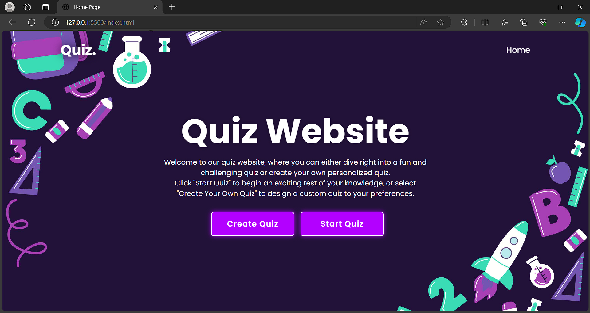
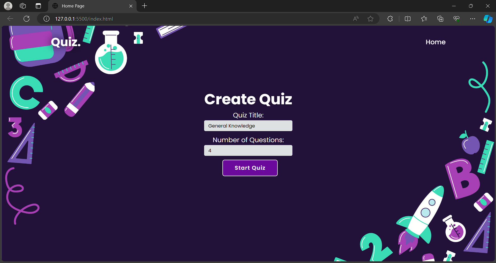
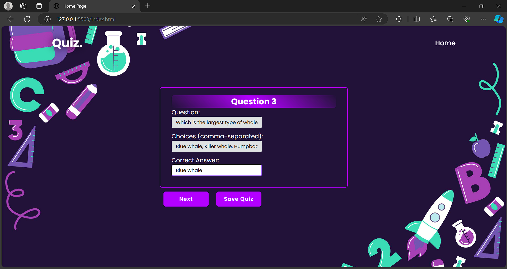
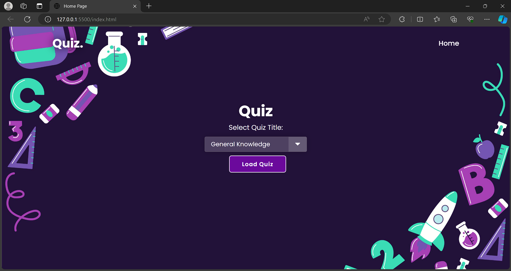
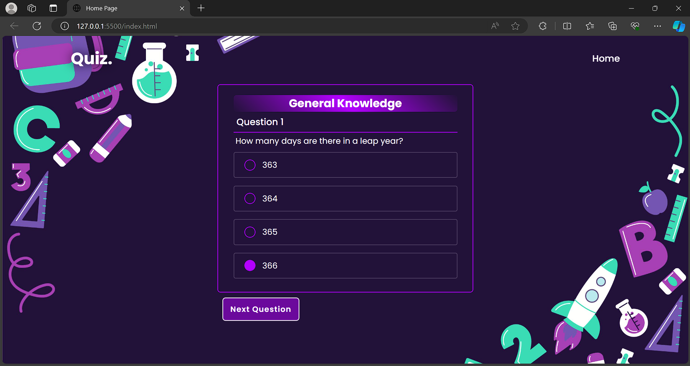
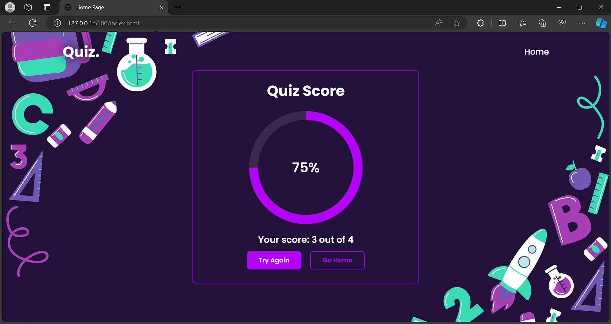

# The Quiz

## Description 

This is a multiple-choice quiz web application designed purely for entertainment purposes. This quiz website offers an engaging platform where users can either test their knowledge with a variety of pre-made quizzes or unleash their creativity by creating custom quizzes. The "Start the Quiz" button lets users immediately dive into a curated selection of quizzes across different topics. Alternatively, the "Make Your Own Quiz" button provides an easy-to-use interface for users to design and share their personalized quizzes with others.
## List of technologies used

- JavaScript
- localStorage 
- HTML
- CSS 
- Bootstrap
- Google Fonts

## Screenshots

### Start menu

### Create Quiz 

### Create Questions 

### Start Quiz 

### Solving Quiz 

### Completion of quiz

## Link

[Link to deployed application](https://website-quiz.netlify.app/)
